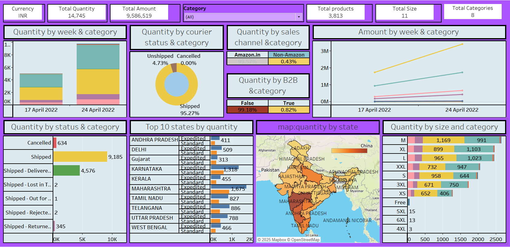

# Amazon Sales Data Analysis

This project provides insights into Amazon sales data across various dimensions, including regional performance, weekly sales trends, product categories, and more.

## Key Features:
- *Quantity by State:* Sales distribution across states.
- *Quantity and Amount by Week and Category:* Weekly sales and revenue trends.
- *Quantity by Size and Category:* Sales breakdown by product size.
- *Top 10 States by Sales and Shipping Level:* Performance across top states and shipping service levels.
- *Quantity by Product Status:* Impact of stock availability on sales.
- *Quantity by Courier Status:* Delivery efficiency and its effect on sales.
- *Sales Channel Performance:* Comparison of sales by different channels (e.g., Amazon vs. third-party).
- *B2B Sales Insights:* Sales data for B2B transactions.

## Usage

To explore the analysis, refer to the individual sheets listed above. Each sheet provides a different view of the sales data to help with business decisions.
